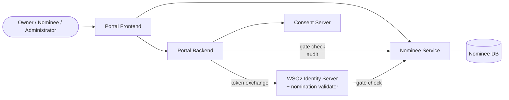
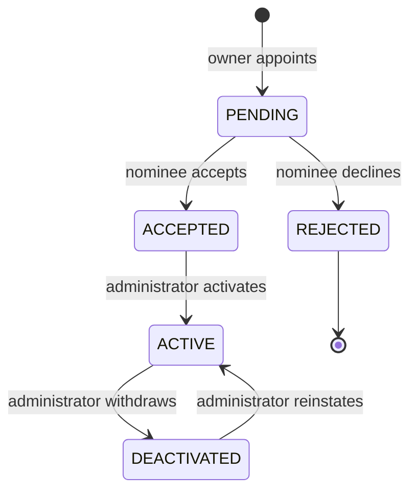
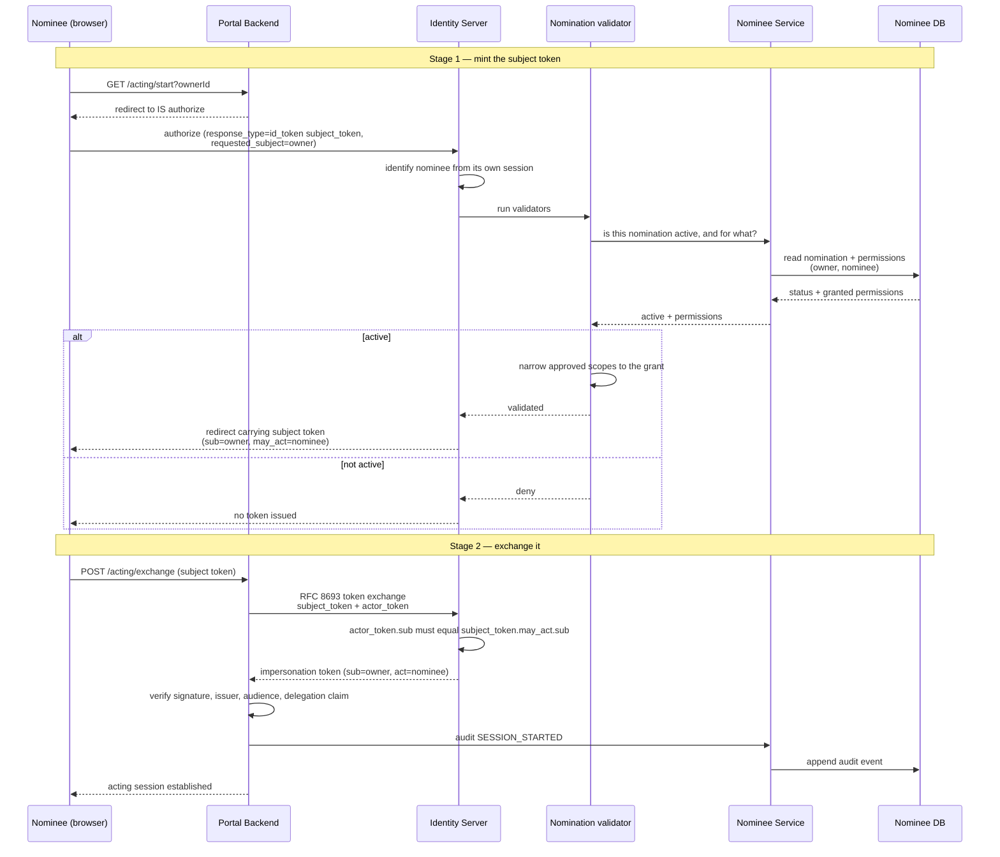
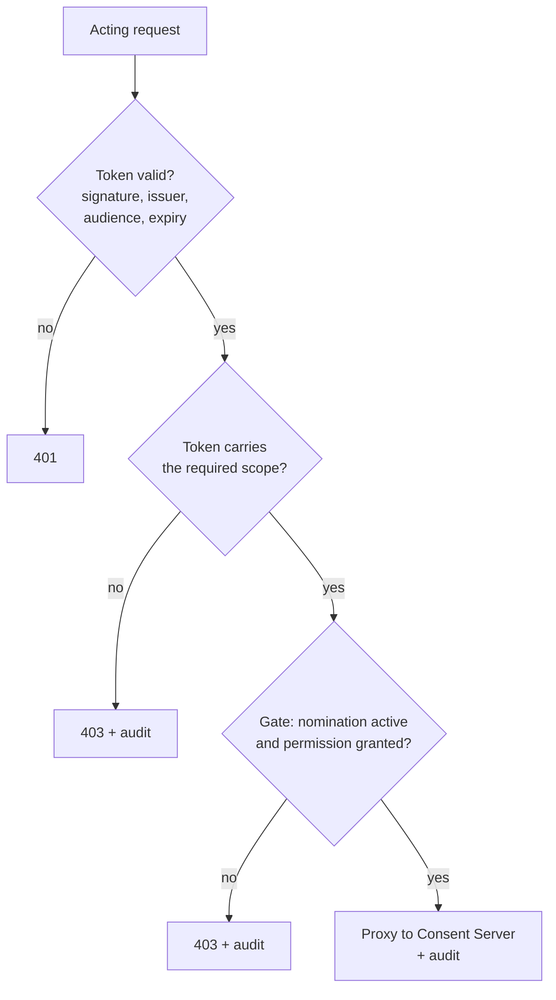
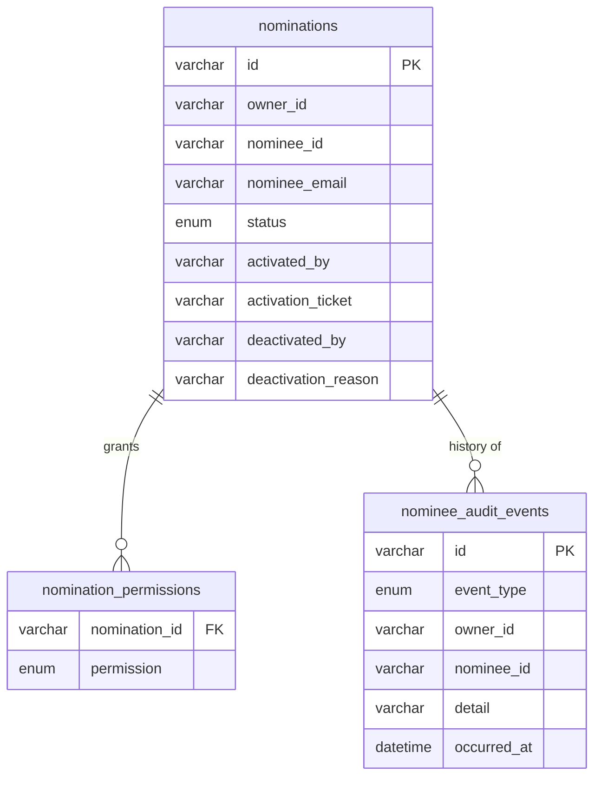

# Nomination - Feature Design

## 1. Purpose

Section 14 of the Digital Personal Data Protection Act allows a Data Principal to
nominate one or more individuals who may exercise their rights on their behalf,
in the event of death or incapacity.

This feature implements that: an account owner appoints nominees, decides what
each may do, and an administrator verifies the appointment before it takes
effect. A nominee then acts on the owner's account under their own identity,
within the owner's grant, with every action recorded.

## 2. Design principles

Four decisions shape everything else.

**The nominee is never anonymous.** A nominee acts *as themselves on behalf of*
the owner, never *as* the owner. Every token, every request and every audit entry
names both parties. A record that says only "the owner revoked this" would be
false.

**Authority is granted in three steps, by three different parties.** The owner
decides *what*, the nominee decides *whether*, and an administrator decides
*when it becomes real*. No single party can create working access alone.

**Authority is checked continuously, not once.** A token proves what was granted
when it was issued. The nomination is re-read on every request, so withdrawal
takes effect immediately rather than at token expiry.

**Delegation does not compound.** A nominee exercises the owner's rights but
never inherits the owner's ability to delegate. They cannot appoint further
nominees, and they never hold administrative standing.

## 3. Concepts

| Term | Meaning |
|---|---|
| **Owner** | The Data Principal whose account and data are involved |
| **Nominee** | A person the owner has appointed to act on their behalf |
| **Nomination** | One owner-to-nominee appointment, with its own permissions and lifecycle |
| **Permission** | A single capability the owner grants that nominee |
| **Acting session** | A period during which a nominee is operating on an owner's account |

An owner may appoint any number of nominees, and a person may be nominated by
several owners. Both directions are ordinary: two parents may each nominate the
same child, and that child holds a separate, independently-governed nomination
from each.

The uniqueness rule is on the **pair**: the same person cannot be nominated twice
by the same owner, since that would create two competing grants for one
relationship.

## 4. Architecture



| Component | Responsibility |
|---|---|
| **Identity Server** | Authenticates people. Issues the delegated token, having asked whether the nomination permits it. |
| **Nomination validator** (IS extension) | Confirms an active nomination before a delegated token is minted, and narrows its scopes to the owner's grant. Designed in [`is-extensions/nomination-impersonation-validator/DESIGN.md`](../is-extensions/nomination-impersonation-validator/DESIGN.md). |
| **Nominee Service** | Owns the nomination record, answers the gate question, and holds the audit trail. Designed in [`nominee-service/DESIGN.md`](../nominee-service/DESIGN.md). |
| **Portal Backend** | Drives the delegation exchange, enforces every acting request, and proxies to the Consent Server. |
| **Portal Frontend** | Owner, nominee and administrator interfaces. |
| **Consent Server** | Holds consents. Knows nothing about nominations; it receives the acting party as the recorded actor. |

**Nominee Service owns the delegation record, and nothing else does.** The
Identity Server has no access to its database; it asks a question over HTTP. This
keeps the identity layer free of application schema, and means the same answer
serves both the moment a token is issued and every request made afterwards.

## 5. Authorisation model

### Roles

| Role | Held by | Purpose |
|---|---|---|
| `PortalUser` | every user | Owners and nominees alike - the same person is an owner of their own data and a nominee of somebody else's |
| `PortalAdmin` | administrators | Reviewing and activating nominations |

### Scopes

| Scope | Meaning |
|---|---|
| `portal:consents:read:self` | Read the token subject's consents |
| `portal:consents:write:self` | Revoke the token subject's consents |
| `portal:consents:approve:self` | Approve the token subject's pending consents |
| `portal:profile:read:self` | Read the token subject's profile |
| `portal:profile:write:self` | Change the token subject's profile |
| `portal:profile:delete:self` | Delete the token subject's account |
| `portal:profile:read:any` | Read any account (administrative) |
| `portal:profile:write:any` | Change any account (administrative) |

`:self` means *the subject of this token*. In a delegated token the subject is
the **owner**, so the same scope covers a user acting for themselves and a
nominee acting for someone else. This is why delegation needs no separate scope
vocabulary - and why `:any` is never delegatable, since it would reach beyond the
one owner the nomination concerns.

### Permissions

What an owner grants a nominee, distinct from OAuth scopes:

| Permission | Grants |
|---|---|
| `CONSENT_VIEW` | See the owner's consents |
| `CONSENT_REVOKE` | Revoke the owner's consents |
| `CONSENT_APPROVE` | Approve consents the owner has pending |
| `ACCOUNT_VIEW` | See the owner's profile |
| `ACCOUNT_UPDATE` | Change the owner's profile |
| `ACCOUNT_DELETE` | Close the owner's account |

Some permissions depend on another and are stored together with it:

```
CONSENT_REVOKE  →  CONSENT_VIEW      a consent must be found before it is revoked
CONSENT_APPROVE →  CONSENT_VIEW      a consent must be found before it is approved
ACCOUNT_UPDATE  →  ACCOUNT_VIEW      a profile must be read before it is changed
ACCOUNT_DELETE  →  ACCOUNT_VIEW
```

A stored grant therefore always describes something the nominee can actually
carry out, rather than an authority they could never reach.

Revocation and approval are deliberately separate grants, and neither implies
the other. They are opposite acts: revoking withdraws processing the owner has
already chosen, while approving authorises new processing in the owner's name.
An owner who trusts a nominee to close down data sharing has not thereby decided
to let that nominee open new sharing, so the two are never bundled.

Permissions map to scopes when a delegated token is minted:

| Permission | Scope carried |
|---|---|
| `CONSENT_VIEW` | `portal:consents:read:self` |
| `CONSENT_REVOKE` | `portal:consents:write:self` |
| `CONSENT_APPROVE` | `portal:consents:approve:self` |
| `ACCOUNT_VIEW` | `portal:profile:read:self` |
| `ACCOUNT_UPDATE` | `portal:profile:write:self` |
| `ACCOUNT_DELETE` | `portal:profile:delete:self` |

## 6. Nomination lifecycle



**Only `ACTIVE` confers authority.** Acceptance alone grants nothing.

**Activation is deliberately manual.** An administrator records a ticket
reference, which is where the verification performed outside the system -
identity, relationship, legal documents - is evidenced. Automating it would make
the audit record meaningless.

**Refusal is terminal.** A declined nomination cannot be accepted afterwards; the
owner creates a new one if they wish to ask again, leaving the refusal standing
in the record.

**Withdrawal is immediate in effect.** A token already issued to the nominee
remains cryptographically valid, so it is the per-request check, not expiry, that
stops them.

### Changing a grant

| When | Add a permission | Remove a permission | Remove the nomination |
|---|---|---|---|
| Before activation | yes | yes | yes |
| After activation | **no** | yes | yes |

Activation records that a *specific* grant was verified. Widening it afterwards
would leave the nominee holding more than was reviewed while the ticket still
claims otherwise. Narrowing stays open because it only ever removes access an
administrator already approved, and an owner must never wait to reduce someone's
reach. Removing the nomination entirely is always available, which is the owner's
immediate remedy.

## 7. Nomination flow

Establishing an acting session, in two stages.



### Why two stages

**The subject token cannot be minted server to server.** The Identity Server
identifies the impersonating party from an interactive session, not from a bearer
token - issuing a token that represents another person requires proof of
interactive authentication. The authorisation step must therefore originate in
the nominee's browser.

**The exchange requires both tokens.** Presenting only the subject token would
make possession sufficient for delegation. Requiring the nominee's own token as
`actor_token` binds the exchange to the party named in `may_act`, so an
intercepted subject token cannot be used by anyone else. The exchange is
performed by the backend because it needs the client secret.

### Claim progression

| Stage | Token | `sub` | Delegation claim |
|---|---|---|---|
| Login | access token | nominee | none |
| Stage 1 | subject token | owner | `may_act` - permission held |
| Stage 2 | impersonation token | owner | `act` - permission in use |

Stages 1 and 2 both name the owner as subject. The distinction is between
authority *held* and authority *in effect*.

## 8. Enforcement

Two independent layers, both of which must pass.



**Layer one - the scope ceiling.** Fixed when the token was minted, and narrowed
there to the owner's grant. A nominee granted view-only holds a token that never
carried the write scope, so a revoke is refused before the gate is consulted.

**Layer two - the live gate.** Re-read on every request. This is what makes
withdrawal take effect immediately, and what catches a permission removed after
the token was issued.

The layers answer different questions. The first asks *what was this token ever
allowed to do*; the second asks *what is this nominee allowed to do right now*.
Neither alone is sufficient: a token cannot know about a later withdrawal, and a
gate check alone would trust a token that was never narrowed.

Both fail closed. If the gate cannot be reached, the request is refused.

### Boundaries

**First-party routes refuse delegated tokens.** A delegated token names the owner
as subject and carries the owner's scopes, so a scope check alone cannot
distinguish it from the owner's own token. Every route outside `/acting/*`
rejects any token bearing `act` or `may_act`. Without this, a nominee could
present the token on an ordinary route and act as the owner with no gate check
and no attribution.

**Nomination management refuses delegated tokens.** Appointing, editing and
removing nominees are rights the owner exercises personally. This is what makes
delegation non-transitive.

**Administrative standing is never delegated.** An administrator acting for an
owner is acting as that owner, and holds no administrative capability for the
duration.

### One acting session per browser

The delegated token is held in a single HttpOnly cookie at one path, so a browser
has one acting session however many tabs are open. Starting a session for a
second owner replaces the first.

That is a deliberate limit, but it leaves the superseded tab believing it is
somewhere it no longer is. Every server-side check would still pass - the token
genuinely is valid for the newer owner - so the tab would render that owner's
records under the previous owner's heading. Nothing about the request is
unauthorised; only the tab is wrong.

The tab therefore states which owner it believes it is acting for, in
`X-Acting-Owner`, and a mismatch against the token's subject is refused with
`409 ACTING_OWNER_MISMATCH`. The tab drops its stale session and reloads rather
than showing one account in the frame of another.

This resolves a disagreement about which session is in play. It is not an
authorisation boundary and is not treated as one: a request that states no owner
asserts nothing and proceeds, because direct API callers hold no tab state. Every
check in §8 runs either way.

## 9. Data model

Three tables, in the nominee database.



Permissions are stored as rows rather than a single column so a grant can be
read, changed and audited one permission at a time.

Supported on MySQL, PostgreSQL and SQLite. The schema is created from a script
per database, and the service validates against it at startup rather than
altering it.

## 10. Audit

Every event is appended and never updated or deleted, so what a nominee did
survives the nomination itself being changed or removed.

| Event | Recorded when |
|---|---|
| `NOMINATED` | An owner appoints a nominee |
| `ACCEPTED` / `REJECTED` | The nominee responds |
| `ACTIVATED` / `DEACTIVATED` | An administrator decides |
| `PERMISSIONS_CHANGED` | An owner changes a grant |
| `REMOVED` | An owner removes a nomination |
| `SESSION_STARTED` / `SESSION_DENIED` | A nominee begins, or is refused, an acting session |
| `ACTION_PERFORMED` / `ACTION_DENIED` | A nominee acts, or is refused |

**Reads and refusals are recorded here or nowhere.** The Consent Server observes
only successful writes: a nominee reading an owner's entire consent list, or
being refused an action, reaches no other system. Under a regime where access
itself is an event, that record has to exist at the delegation boundary.

Actions taken on consents are additionally recorded by the Consent Server with
the **nominee** as the acting party, never the owner.

## 11. Security properties

| Property | How it holds |
|---|---|
| A nominee cannot exceed the owner's grant | Scopes narrowed at mint; gate re-checked per request |
| A withdrawn nomination stops access at once | Gate is read on every request, not at token expiry |
| A stolen subject token is not usable | The exchange requires the nominee's own token as proof |
| A delegated token cannot be replayed elsewhere | Every non-acting route rejects `act` / `may_act` |
| A nominee cannot appoint further nominees | Nomination management refuses delegated tokens |
| Actions are attributed to the real person | The nominee is the recorded actor throughout |
| Every delegated action is attributable | Audit records name the nominee, never the owner |
| Infrastructure callers cannot be impersonated | Shared key compared in constant time |
| A missing dependency denies rather than allows | Gate failure, verifier failure and missing configuration all refuse |

## 12. Future work

**Notifications.** Nominees and owners are not told when a nomination is created,
accepted, activated, changed or withdrawn. The events exist; delivery does not.
This matters most for withdrawal, where the affected party currently learns only
by being refused.

**Profile permissions.** `ACCOUNT_VIEW`, `ACCOUNT_UPDATE` and
`ACCOUNT_DELETE` can be granted and are carried in the delegated token, but no
endpoint consumes them. Consent viewing, revocation and approval are the
implemented surface. `ACCOUNT_DELETE` in particular deserves its own
review before implementation, being irreversible and high-value.

